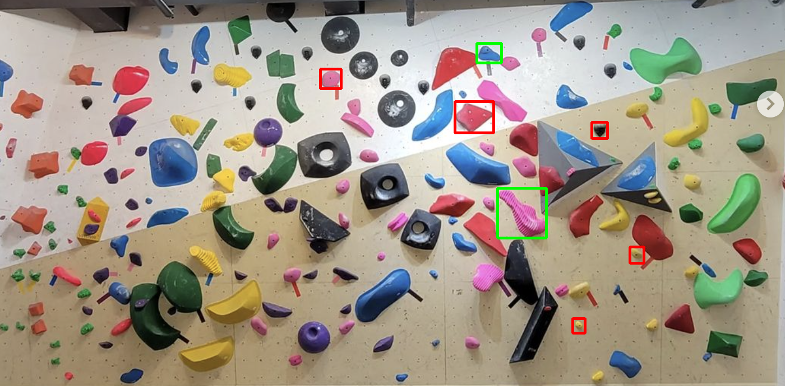
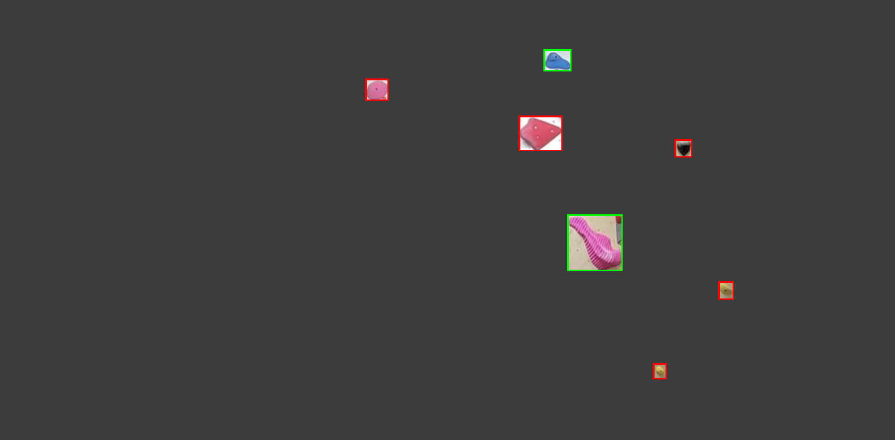
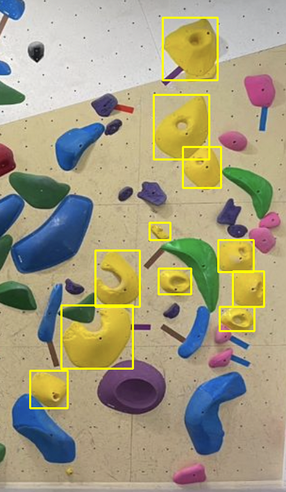
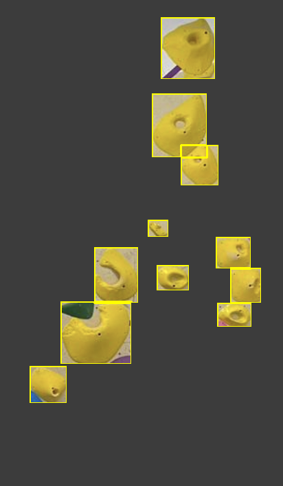

# Climb easier

## Project Overview

The climb easier project trains and utilizes the trained detection model to detect climbing holds from wall images with high precision and recall. It includes three main functionalities:
1. **Detect holds:** Detects climbing holds in an image
2. **Generate Climb:** Generates climbing routes based on detected holds in an image.
3. **Simplify Climb:** Simplifies the visualization of climbing routes by highlighting holds that match specified colors, thus reducing visual clutter and focusing on particular climbing paths.

## Key Features

- **Hold Detection:** Utilizes a trained YOLOv8 model to detect climbing holds.
- **Route Generation:** Dynamically generates climbing routes from any given climbing wall image.
- **Route Simplification:** Filters and highlights climbing holds based on target color to simplify route visualization.
- **Visualization:** Offers capabilities to visually display and save the modified climbing wall images for analysis or demonstration purposes.


## Installation

### Prerequisites

- Python 3.9+


### Setup


```
pip install ultralytics
pip install opencv-python
```

## Detection model training

- Model: YOLOv8 model (from ultralytics)
- Dataset: 5854 labeled images from roboflow (https://universe.roboflow.com/chiang-mai-university-i0wly/neural-climb-v2
)
- Result (30 epochs): 0.902 precision and 0.848 recall on validation data

## Usage

### **Detecting climbing holds**
```
python src/models/inference.py --img_path "path/to/image.png" --show --save
```

* --img_path: This required argument specifies the path to the image file where the holds will be detected.
* --model_path: An optional argument that defaults to a predefined model path but can be overridden by the user.
* --show: A boolean flag that, when present, will trigger the visualization of the results. 
* --save: Save the image with the detected holds in the output/detect_holds folder.

##### Example (python src/models/inference.py --img_path "input/test_image.png" --show --save)


### **Generating Climbing Routes**

```
python src/generate_climb.py --img_path "path/to/image.png" --num_holds 10 --vertical_min 10 --vertical_max 30 --horizontal_min 10 --horizontal_max 30 --max_start_height 20 --show --save
```

* --img_path: Path to the climbing wall image.
* --num_holds: Number of holds to include in the generated route.
* --vertical_min: Minimum vertical distance percentage between holds.
* --vertical_max: Maximum vertical distance percentage between holds.
* --horizontal_min: Minimum horizontal distance percentage between holds.
* --horizontal_max: Maximum horizontal distance percentage between holds.
* --max_start_height: Maximum start height percentage from the bottom of the image.
* --show: Display the generated climbing route.
* --save: Save the image with the generated route in the output/genereated_climb folder.

##### Example (python src/generate_climb.py --img_path "input/test_image.png" --num_holds 7 --vertical_min 10 --vertical_max 30 --horizontal_min 10 --horizontal_max 30 --max_start_height 30 --show --save)





**Green boxes are the start and end holds for the generated climb**

---


### **Simplifying Climbing Images by Color**
```
python src/simplify_climb.py --img_path "path/to/image.png" --target_color "yellow" --show --save
```

* --img_path: Path to the climbing wall image.
* --target_color: Color to highlight (yellow, purple, black, white, green, blue, pink).
* --show: Display the processed image.
* --save: Save the processed image in the output/simplified_climb folder.

##### Example (python src/simplify_climb.py --img_path "input/color_test_image.png" --target_color "yellow" --show --save)







## Detailed Methods


### Generate Climb
The generate_climb.py script generates climbing routes from images by detecting climbing holds and strategically choosing a path (with randomness). Here’s a step-by-step breakdown of its functionality:

1. Hold Detection:
Holds are detected using the trained detection model.
2. Hold Selection Logic:
Holds are sorted based on their vertical position in the image to facilitate the generation of a climbing path from bottom to top.
The script calculates the allowable height range for the starting hold to ensure it is within a reachable distance from the bottom.
Holds are then filtered and a starting hold is chosen randomly from those that are close enough to the ground.
3. Route Generation Algorithm:
The algorithm calculates both vertical and horizontal distance constraints based on the provided percentages.
It then selects subsequent holds that meet these distance constraints, ensuring each next hold is vertically higher than the current hold. This mimics the natural progression of a climbing route.
4. Result Display and Saving:
If enabled, the script visualizes and saves the route by drawing colored boxes around the selected holds. Different colors distinguish the starting and ending holds from the rest.

### Simplify Climb
The simplify_climb.py script focuses on simplifying the visualization of climbing routes by emphasizing holds of a specific color, helping climbers focus on a particular route or training set:

1. Hold Detection:
Holds are detected using the trained detection model.
2. Mask Generation:
Generates a binary mask for each detected hold, focusing on a central portion of the hold to improve the accuracy of color detection.
3. Color Clustering:
Each detected hold's image patch is converted to the HSV color space, which is often more effective for color clustering.
The script uses k-means clustering to find the most dominant color within the masked area of each hold.
4. Color Matching:
After determining the dominant color of each hold, the script compares this color to a set of predefined colors using a defined distance metric in the HSV space.
Holds that match the target color specified by the user are highlighted, and the rest are ignored in the visualization.
5. Result Display and Saving:
Optionally displays and saves the processed image with the highlighted holds.


## Limitations
1. The detection model has low accuracy in detecting volume holds.
2. The detection model sometimes falsely detects colored tape.
3. The climbing route generation method solely relies on the vertical and horizontal distances between holds to account for the difficulty of climb.
4. The color matching method needs improvements for certain target colors such as blue and purple. 
5. The color matching method may not work well in dark lighting or for hold colors that deviate a lot from the predefined color values.

## Improvements to be made
1. Label colors for holds and train a model to detect and classify the color of holds.
2. Come up with a better method to account for generating climbign routes of varying difficulty other than the vertical and horizontal distance between holds. 